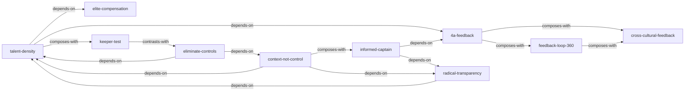

# 不拘一格：网飞的自由与责任工作法 — Skill Index

> 本书由 book2skill 蒸馏, 共产出 **10** 个 skills。
> 处理时间: 2026-04-15

## 关于这本书

- **作者**: [美] 里德·哈斯廷斯 (Reed Hastings) / [美] 艾琳·迈耶 (Erin Meyer)
- **出版年**: 2020
- **一句话主旨**: 通过提高人才密度、建立坦诚反馈文化、取消管控规则三个飞轮，构建以"自由与责任"为核心的创新型组织
- **整书理解**: 见 [BOOK_OVERVIEW.md](./BOOK_OVERVIEW.md)

---

## Skill 列表 (按主题分组)

### 反馈与沟通

- [`4a-feedback`](./4a-feedback/SKILL.md) — 4A反馈准则：目的在于帮助、可行性、感激赞赏、接受或拒绝的双向反馈框架
- [`feedback-loop-360`](./feedback-loop-360/SKILL.md) — 360度反馈循环：具名书面反馈+面对面晚餐法的制度化反馈机制
- [`cross-cultural-feedback`](./cross-cultural-feedback/SKILL.md) — 跨文化反馈适应：第5条准则、升格语/降格语、间接文化中的正式反馈

### 人才与团队

- [`talent-density`](./talent-density/SKILL.md) — 人才密度提升：通过淘汰表现欠佳者构建高绩效团队的行为传染力管理
- [`keeper-test`](./keeper-test/SKILL.md) — 员工留任测试："如果他想辞职你会挽留吗？" + 慷慨遣散 + 离职后公开问答

### 管理与决策

- [`context-not-control`](./context-not-control/SKILL.md) — 情景管理而非控制管理：树形情景设定模型，从控制转向赋能
- [`informed-captain`](./informed-captain/SKILL.md) — 知情指挥决策模型：收集异议+知情指挥大胆下注+正视失败的四步创新流程

### 组织文化

- [`elite-compensation`](./elite-compensation/SKILL.md) — 精英薪酬策略：市场最高薪资、不设奖金、主动调薪、鼓励接猎头电话
- [`radical-transparency`](./radical-transparency/SKILL.md) — 开卷管理：默认透明、阳光行动、"成功了小声说，犯错了大声说"
- [`eliminate-controls`](./eliminate-controls/SKILL.md) — 取消管控：无限期休假+六字经费政策+事前情景设定事后核实

---

## 引用图



图例:
- `-->` depends-on (使用前需先理解)
- `-.->` contrasts-with (对比关系)
- `===>` composes-with (经常配合使用)

---

## 推荐学习顺序

(从依赖图的叶子节点开始, 向上)

1. **talent-density** — 最基础，没有高人才密度其他都玩不转
2. **4a-feedback** — 反馈的基本功，依赖人才密度
3. **elite-compensation** — 人才密度的薪酬保障
4. **keeper-test** — 人才密度的持续维护机制
5. **feedback-loop-360** — 4A的制度化升级
6. **radical-transparency** — 信息基础，依赖人才密度
7. **informed-captain** — 决策权下放，依赖透明+人才密度+反馈
8. **context-not-control** — 管理哲学顶层，依赖以上所有
9. **eliminate-controls** — 自由政策，依赖情景管理能力
10. **cross-cultural-feedback** — 全球化扩展，在4A和360基础上适应

---

## 接入 darwin-skill

所有 skill 均带有 `test-prompts.json` (darwin-skill 兼容格式), 可直接接入自动进化:

```
darwin evolve books/no-rules-rules-skill/
```

---

## 审计轨迹

- 候选单元池: [candidates/](./candidates/)
- 被淘汰的候选 (含原因): [rejected/](./rejected/)
- BOOK_OVERVIEW: [BOOK_OVERVIEW.md](./BOOK_OVERVIEW.md)
